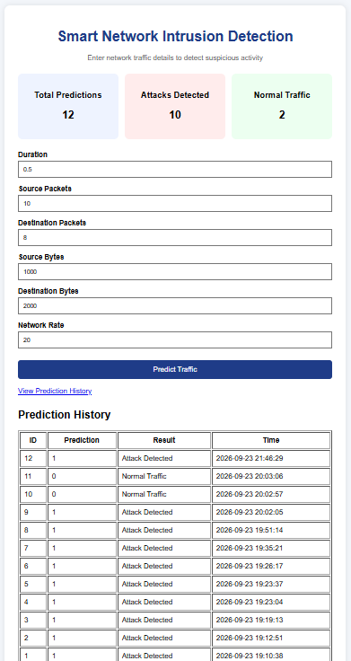

# Smart Network Intrusion Detection System

A machine learning-based web application that detects network traffic as Normal Traffic or Attack Traffic.

## Technologies Used

- Python
- Pandas
- NumPy
- Scikit-learn
- Flask
- MySQL
- PyMySQL
- HTML, CSS, JavaScript
- Postman

## Dataset

UNSW-NB15 Dataset

## Machine Learning Model

Random Forest Classifier

Test Accuracy: 97.69%

## Features

- Network traffic prediction
- Attack detection
- Normal traffic detection
- Flask REST API
- MySQL prediction storage
- Prediction history
- Dashboard statistics

## How to Run

Activate the virtual environment:

.\venv\Scripts\Activate.ps1

Install dependencies:

python -m pip install -r requirements.txt

Run the application:

python .\app\app.py

Open in browser:

http://127.0.0.1:5000

## Dashboard Screenshot

